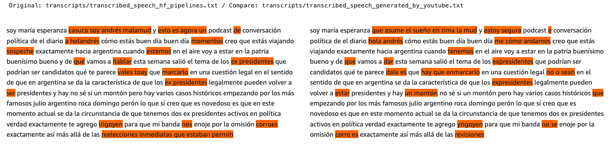

# Long-form audio transcription with Hugging Face Transformers

Extract from [Hugging Face](https://huggingface.co/docs/transformers/tasks/asr):

> Automatic speech recognition (ASR) converts a speech signal to text. It is an example of a sequence-to-sequence task, going from a sequence of audio inputs to textual outputs. Voice assistants like Siri and Alexa utilize ASR models to assist users.

This guide will give you a quick step by step tutorial about how to create an end to end Automatic Speech Recognition (ASR) solution that deals with long-form audio e.g. podcasts, videos, audiobooks, etc.

## Getting started
- [Intro to Automatic Speech Recognition on 🤗](https://huggingface.co/tasks/automatic-speech-recognition)
- [Robust Speech Challenge Results on 🤗](https://huggingface.co/spaces/speech-recognition-community-v2/FinalLeaderboard)
- [Mozilla Common Voice 9.0](https://huggingface.co/datasets/mozilla-foundation/common_voice_9_0)
- [Thunder-speech, A Hackable speech recognition library](https://scart97.github.io/thunder-speech/Ultimate%20guide/)
- [SpeechBrain - PyTorch powered speech toolkit](https://speechbrain.github.io/)
- [Neural building blocks for speaker diarization: speech activity detection, speaker change detection, overlapped speech detection, speaker embedding](https://github.com/pyannote/pyannote-audio)
- [SPEECH RECOGNITION WITH WAV2VEC2](https://pytorch.org/tutorials/intermediate/speech_recognition_pipeline_tutorial.html)
- [How to add timestamps to ASR output](https://github.com/huggingface/transformers/issues/11307)
- [Host Hugging Face transformer models using Amazon SageMaker Serverless Inference](https://aws.amazon.com/de/blogs/machine-learning/host-hugging-face-transformer-models-using-amazon-sagemaker-serverless-inference/)

## Video Tutorial in YouTube 
[](https://www.youtube.com/watch?v=wFjPxz22MEs)

## Requirements
- [SageMaker Studio Lab](https://studiolab.sagemaker.aws/) account. See this [explainer video](https://www.youtube.com/watch?v=FUEIwAsrMP4) to learn more about this.
- Python>=3.7
- PyTorch>=1.10
- Hugging Face Transformers
- Several audio processing libraries (see `environment.yml`)

## Step by step tutorial

### Clone repo and install dependencies

Follow the steps shown in `example_w_HuggingFace.ipynb` [](https://studiolab.sagemaker.aws/import/github/machinelearnear/long-audio-transcription-spanish/blob/main/example_w_HuggingFace.ipynb) Click on `Copy to project` in the top right corner. This will open the Studio Lab web interface and ask you whether you want to clone the entire repo or just the Notebook. Clone the entire repo and click `Yes` when asked about building the `Conda` environment automatically. You will now be running on top of a `Python` environment with `Streamlit` and `Gradio` already installed along with other libraries.

### Download audio directly from YouTube

We first point to the Spaces url that we want to run on Studio Lab:

```python
from os.path import exists as path_exists
YouTubeID = 'YOUR_YOUTUBE_ID' 
OutputFile = 'YOUR_AUDIO_FILE.m4a'
if not path_exists(OutputFile):
    !youtube-dl -o $OutputFile $YouTubeID --extract-audio --restrict-filenames -f 'bestaudio[ext=m4a]'
```

### Process using `Librosa`/`HuggingFace`

```python
import librosa
from transformers import pipeline
pipe = pipeline(model=model_name)
speech, sample_rate = librosa.load(OutputFile,sr=16000)
transcript = pipe(speech, chunk_length_s=10, stride_length_s=(4,2))
```

### Split long audio into smaller chunks with `PyDub`

```python
import torch
import pydub
import array
import numpy as np
from pydub.utils import mediainfo
from pydub import AudioSegment
from pydub.utils import get_array_type

def audio_resampler(sound, sample_rate=16000):
    sound = sound.set_frame_rate(sample_rate)
    left = sound.split_to_mono()[0]
    bit_depth = left.sample_width * 8
    array_type = pydub.utils.get_array_type(bit_depth)
    numeric_array = np.array(array.array(array_type, left._data))
    
    return np.asarray(numeric_array,dtype=np.double), sample_rate

pydub_speech = pydub.AudioSegment.from_file(OutputFile)
speech, sample_rate = audio_resampler(pydub_speech)

transcript = ''
for chunk in np.array_split(speech,len(speech)/sample_rate/30)[:2]: # split every 30 seconds, take only first minute
    output = pipe(chunk)
    transcript = transcript + ' ' + output['text']
    print(output)
    
transcript = transcript.strip()
```

### Split long audio into chunks based on detected silence

```python
import librosa
from librosa import display
import matplotlib.pyplot as plt

speech, sample_rate = librosa.load(OutputFile,sr=16000)
non_mute_sections_in_speech = librosa.effects.split(speech,top_db=50)

transcript = ''
for chunk in non_mute_sections_in_speech[:6]:
    speech_chunk = speech[chunk[0]:chunk[1]]
    output = pipe(speech_chunk)
    transcript = transcript + ' ' + output['text']
    print(output)
    
transcript = transcript.strip()
```

### Compare results between open-source vs Google-generated

```python
from youtube_transcript_api import YouTubeTranscriptApi
transcript = YouTubeTranscriptApi.get_transcript(YouTubeID,languages=['es'])
transcript_from_YouTube = ' '.join([i['text'] for i in transcript])

from utils import *
from IPython.display import HTML, display
base = "transcripts/transcribed_speech_hf_pipelines.txt"
compare = "transcripts/transcribed_speech_generated_by_youtube.txt"
a = open(base,'r').readlines()[0][:1000]
b = open(compare,'r').readlines()[0][:1000]
print(f'Original: {base} / Compare: {compare}')
display(HTML(html_diffs(a,b)))
```



## Keep reading
- [Pyctcdecode & Speech2text decoding](https://www.youtube.com/watch?v=mp7fHMTnK9A&t=5s)
- [XLS-R: Large-Scale Cross-lingual Speech Representation Learning on 128 Languages](https://www.youtube.com/watch?v=ic_J7ZCROBM)
- [Unlocking global speech with Mozilla Common Voice](https://www.youtube.com/watch?v=Vvn984QmAVg)

## Citations
```bibtex
@misc{grosman2022wav2vec2-xls-r-1b-spanish,
  title={XLS-R Wav2Vec2 Spanish by Jonatas Grosman},
  author={Grosman, Jonatas},
  publisher={Hugging Face},
  journal={Hugging Face Hub},
  howpublished={\url{https://huggingface.co/jonatasgrosman/wav2vec2-xls-r-1b-spanish}},
  year={2022}
}
```

## Disclaimer
- The content provided in this repository is for demonstration purposes and not meant for production. You should use your own discretion when using the content.
- The ideas and opinions outlined in these examples are my own and do not represent the opinions of AWS.
